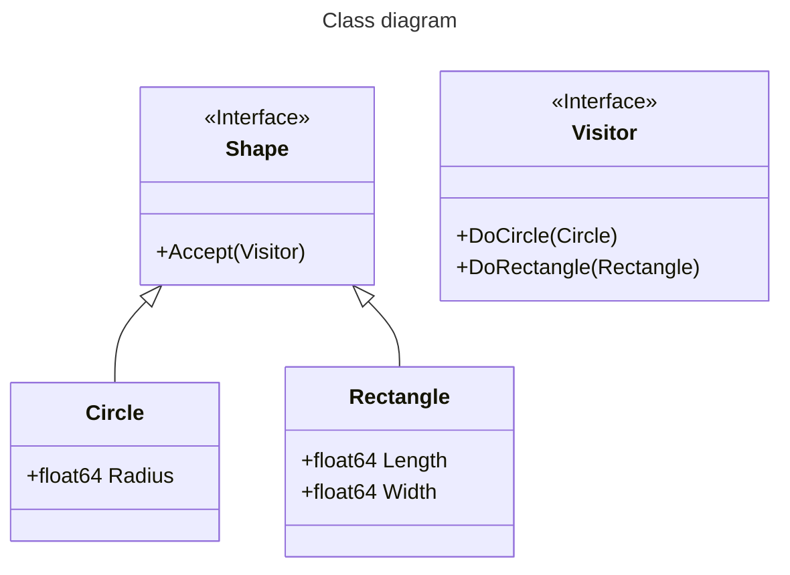
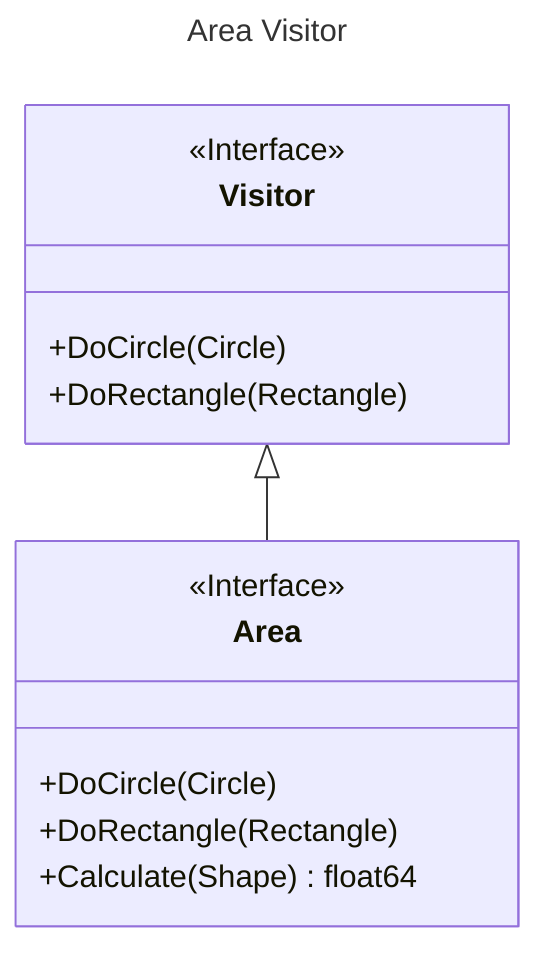
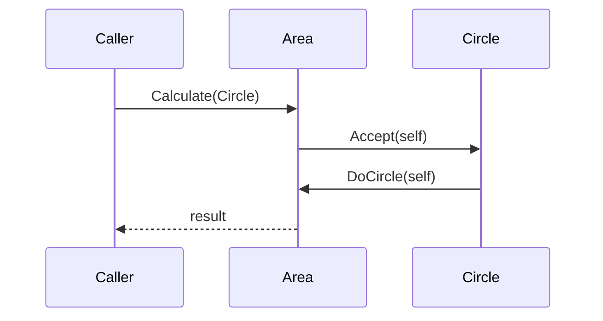

The [visitor pattern](guides/software/patterns#visitor) allows us to extend the behaviour of various objects through a common interface.

It is particularly powerful when working with the composite pattern or any kind of graph execution where we want to keep our graph traversal logic seperate from our handling logic.

## The Pattern

To show how the visitor pattern works, we will extend arbitrary shapes using visitors.

For example, we may have a `Shape` class which:
* accepts a `Visitor`
* is implemented by `Circle` and `Rectangle`



Say we define an `Area` visitor:



If we call `Area::Calculate` we get:


The call to `Accept` and `DoCircle` is known as double dispatch and allows the `Caller` to not know that the `Shape` it has sent `Area` is infact a `Circle`.

## Go Code

In `go` this looks like:
```go
type Visitor interface {
  DoCircle(Circle)
  DoRectangle(Rectangle)
}

type Shape interface {
  Accept(Visitor)
}

type Circle struct {
  float64 Radius
}

func (c *Circle) Accept(v Visitor) {
  v.DoCircle(c)
}

type Rectangle struct {
  float64 Length
  float64 Width
}

func (r *Rectangle) Accept(v Visitor) {
  v.DoRectangle(c)
}
```

We are now setup to extend `Circle` and `Rectangle` shapes as much as we like.

An `Area` visitor will look like:
```go
type Area struct {
  float64 result
}

func (v *Area) Calculate(s Shape) float64 {
  s.Visit(v)
  return v.result
}

func (av *Area) DoCircle(c *Circle) {
  v.result = math.Pi * math.Pow(c.Radius,2)
}

func (v *Area) DoRectangle(r *Rectangle) {
  v.result = r.Length * r.Height
}
```

Another example is a `Circumference` visitor:
```go
type Circumference struct {
  float64 result
}

func (v *Circumference) Calculate(s Shape) float64 {
  s.Visit(v)
  return v.result
}

func (a *Circumference) DoCircle(c *Circle) {
  v.result = 2.0 * math.Pi * c.Radius
}

func (v *Circumference) DoRectangle(r *Rectangle) {
  v.result = 2.0 * (r.Length + r.Height)
}
```


